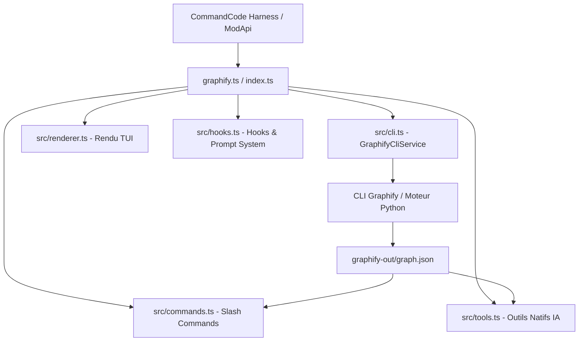

<div align="center">

# 🕸️ CommandCode Graphify Mod (`cmd-mod-graphify`)

[](https://opensource.org/licenses/MIT)
[](https://www.typescriptlang.org/)
[](https://commandcode.ai/)
[](https://github.com/Graphify-Labs/graphify)

**Transformez n'importe quelle base de code en un Graphe de Connaissances déterministe et interrogeable directement dans CommandCode.**

[ 🇫🇷 **Français** ](README.fr.md) | [ 🇬🇧 **English** ](README.md)

</div>

---

## ⚡ Démarrage Rapide (30 Secondes)

```bash
# 1. Installer la CLI Graphify
uv tool install graphifyy

# 2. Lancer CommandCode avec le mod chargé
cmd --mod /chemin/vers/cmd-mod-graphify/graphify.ts

# 3. Dans CommandCode, exécuter :
/graphify
```

---

## 📌 Présentation

**`cmd-mod-graphify`** intègre nativement [Graphify](https://github.com/Graphify-Labs/graphify) au sein de [CommandCode](https://commandcode.ai). Le mod analyse l'AST de votre code source via Tree-sitter, génère un graphe complet des relations (classes, fonctions, imports, appels), et permet des recherches immédiates en langage naturel, des cartes visuelles interactives et une synthèse automatique de l'architecture.

> 💡 **Mode par défaut (`--code-only --mode deep`)** : Par défaut, ce mod s'exécute **100 % en local** via extraction AST, sans nécessiter de clé API LLM. Plus de **8 900+ liaisons (edges)** et **180+ communautés** sont extraites de manière déterministe !

---

## 🔧 Prérequis Système & Versions Testées

| Composant | Version Testée / Recommandée | Exigence & Rôle |
| :--- | :--- | :--- |
| **CommandCode** | `v1.7.0`+ | Support du harness TypeScript ModApi (`cmd.addCommand`, `cmd.addTool`, `cmd.addRenderer`) |
| **Graphify CLI** | `v0.9.32`+ (`graphifyy` sur PyPI) | Installé via `uv tool install graphifyy` ou `pipx install graphifyy` |
| **Node.js** | `v18.0.0`+ / `v20.0.0`+ | Exécution du runtime TypeScript ModApi |
| **Python** | `v3.10`+ / `v3.12.3` | Moteur d'extraction AST Tree-sitter de Graphify |
| **Système d'Exploitation** | Linux, WSL2 (Ubuntu 22.04/24.04), macOS, Windows 10/11 | Support natif de l'ouverture automatique de navigateurs sous WSL (`wslview` / `cmd.exe`) |

---

## ✨ Fonctionnalités clés

- ⚡ **14 Commandes Slash Interactives** : Génération, mise à jour, recherche, visualisation et gestion des règles d'exclusion.
- 🤖 **10 Outils Natifs pour l'IA** : Permet à votre assistant IA d'analyser de manière autonome les connexions de symboles, tracer les dépendances et explorer les communautés.
- 🎨 **Rendu TUI Adaptatif** : En-têtes à barre gauche néon et badges de catégories (`🙈 IGNORE`, `🛠️ BUILD`, `🔍 QUERY`, `💡 EXPLAIN`, `📊 REPORT`).
- 🌳 **Visualisations Web Interactives** : Génération d'arbres D3 dépliables (`/graphify-tree`) et de diagrammes de flux Mermaid (`/graphify-callflow`) s'ouvrant automatiquement dans votre navigateur (support WSL via `wslview` ou `cmd.exe` en secours).
- 📝 **Wiki Markdown Auto-généré** : Documentation structurée par communautés (`/graphify-wiki` → `WIKI.md`).
- 🏛️ **Détection des Hubs (God-Nodes)** : Identification des composants architecturaux critiques en filtrant automatiquement le bruit des `node_modules` et bundles minifiés.
- 🙈 **Gestion `.graphifyignore`** : Prise en compte des règles d'exclusion avec négation `!` et commande dédiée (`/graphify-ignore`).
- 🧠 **Enrichissement Dynamique du Prompt Système** : Injection automatique des hubs principaux et statistiques du graphe dans le contexte de l'IA à chaque échange.

---

## 💬 Raccourcis de Chat Directs

Saisissez directement dans la zone de chat sans utiliser de commande slash :

- `@graph <question>` → Interroge le graphe de connaissances et transmet les liaisons à l'IA pour la synthèse.
- `@explain <symbole>` → Analyse un symbole et explique ses connexions et dépendances architecturales.

---

## 🏗️ Architecture & Fichiers Sources



### 📁 Cartographie du Code Source

| Fichier / Dossier | Rôle & Description |
| :--- | :--- |
| [`graphify.ts`](graphify.ts) / [`index.ts`](index.ts) | Point d'entrée du mod enregistrant tous les composants auprès de `ModApi`. |
| [`src/cli.ts`](src/cli.ts) | Service `GraphifyCliService` (exécution processus, résolution chemins, détection WSL et calcul des degrés via `links`). |
| [`src/commands.ts`](src/commands.ts) | Implémentation des 14 commandes slash avec retours visuels TUI instantanés. |
| [`src/tools.ts`](src/tools.ts) | Enregistrement des 10 outils natifs IA exécutables par le modèle. |
| [`src/renderer.ts`](src/renderer.ts) | Rendu TUI personnalisé avec badges et coloration syntaxique de `.graphifyignore`. |
| [`src/hooks.ts`](src/hooks.ts) | Raccourcis de saisie (`@graph`, `@explain`) et enrichissement du prompt système. |
| [`src/types.ts`](src/types.ts) | Interfaces TypeScript et logique de filtrage des nœuds métier `isDomainNode`. |

---

## 🚀 Installation & Utilisation

### Préréquis
Installer Python & la CLI Graphify :
```bash
uv tool install graphifyy
# OU
pipx install graphifyy
```

### Chargement du Mod

#### Option A : Session ponctuelle
```bash
cmd --mod /chemin/vers/cmd-mod-graphify/graphify.ts
```

#### Option B : Mod par projet
```bash
mkdir -p .commandcode/mods/
cp /chemin/vers/cmd-mod-graphify/graphify.ts .commandcode/mods/
```

---

## ⚡ Référence des Commandes Slash

| Commande | Syntaxe | Description |
| :--- | :--- | :--- |
| `/graphify` | `/graphify [path]` | Construit le graphe AST (`--code-only --mode deep` par défaut). |
| `/graphify-update` | `/graphify-update` | Nettoie le cache et force la reconstruction complète. |
| `/graphify-clean` | `/graphify-clean` | Supprime le répertoire cache `graphify-out/`. |
| `/graphify-query` | `/graphify-query <question>` | Interroge le graphe — l'IA synthétise la réponse. |
| `/graphify-explain` | `/graphify-explain <symbole>` | Analyse les connexions et dépendances d'un symbole. |
| `/graphify-path` | `/graphify-path <A> <B>` | Trace le chemin le plus court entre deux symboles. |
| `/graphify-god-nodes` | `/graphify-god-nodes [N]` | Affiche les N hubs architecturaux les plus connectés. |
| `/graphify-nodes` | `/graphify-nodes [filtre]` | Liste les nœuds métier filtrés par mot-clé. |
| `/graphify-ignore` | `/graphify-ignore [règles]` | Affiche ou ajoute des règles d'exclusion dans `.graphifyignore`. |
| `/graphify-tree` | `/graphify-tree` | Génère un arbre D3 interactif et l'ouvre dans le navigateur. |
| `/graphify-callflow` | `/graphify-callflow` | Génère un diagramme de flux Mermaid et l'ouvre dans le navigateur. |
| `/graphify-wiki` | `/graphify-wiki` | Génère un wiki Markdown structuré par communautés (`WIKI.md`). |
| `/graphify-open` | `/graphify-open` | Ouvre le visualiseur interactif HTML `graph.html`. |
| `/graphify-report` | `/graphify-report` | Affiche le rapport d'architecture `GRAPH_REPORT.md`. |

---

## 🤝 Contribution & Standards d'Issues

Les contributions et signalements de bugs sont les bienvenus ! Veuillez utiliser nos modèles d'issues GitHub :

- 🐛 [Signaler un bug](.github/ISSUE_TEMPLATE/bug_report.md)
- ✨ [Proposer une fonctionnalité](.github/ISSUE_TEMPLATE/feature_request.md)

---

## 📜 Licence & Disclaimer

<div align="center">

⭐ **Si vous trouvez ce mod utile, n'oubliez pas de lui donner une étoile ⭐️ sur GitHub !**

⚡ **Fait avec [CommandCode](https://commandcode.ai) pour CommandCode**

Distribué sous licence **MIT**. Mod communautaire indépendant non affilié à Graphify-Labs ou Langbase, Inc.

</div>
