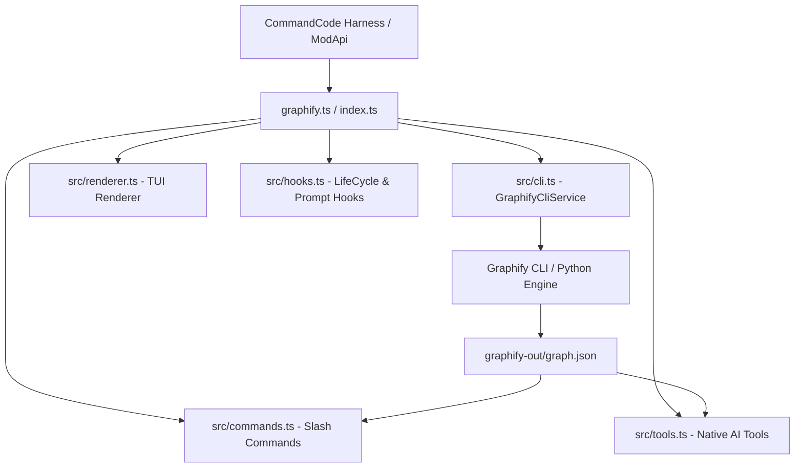

<div align="center">

# 🕸️ CommandCode Graphify Mod (`cmd-mod-graphify`)

[](https://opensource.org/licenses/MIT)
[](https://www.typescriptlang.org/)
[](https://commandcode.ai/)
[](https://github.com/Graphify-Labs/graphify)

**Turn any codebase into a deterministic, queryable Knowledge Graph directly inside CommandCode.**

[ 🇬🇧 **English** ](README.md) | [ 🇫🇷 **Français** ](README.fr.md)

</div>

---

## ⚡ Quick Start (30 Seconds)

```bash
# 1. Install Graphify CLI
uv tool install graphifyy

# 2. Launch CommandCode with the mod loaded
cmd --mod /path/to/cmd-mod-graphify/graphify.ts

# 3. Inside CommandCode, run:
/graphify
```

---

## 📌 Overview

**`cmd-mod-graphify`** seamlessly integrates [Graphify](https://github.com/Graphify-Labs/graphify) into [CommandCode](https://commandcode.ai). It analyzes your local source code via Tree-sitter AST, constructs a deep graph of relationships (classes, functions, imports, calls), and enables instant natural language queries, visual interactive maps, and automated architecture synthesis.

> 💡 **Default Mode (`--code-only --mode deep`)**: By default, this mod runs **100% locally** using AST extraction without requiring any LLM API key. Over **8,900+ relationship edges** and **180+ communities** are extracted deterministically!

---

## 🔧 System Requirements & Tested Versions

| Component | Tested / Recommended Version | Requirement |
| :--- | :--- | :--- |
| **CommandCode** | `v1.7.0`+ | Supports ModApi TypeScript harness (`cmd.addCommand`, `cmd.addTool`, `cmd.addRenderer`) |
| **Graphify CLI** | `v0.9.32`+ (`graphifyy` on PyPI) | Installed via `uv tool install graphifyy` or `pipx install graphifyy` |
| **Node.js** | `v18.0.0`+ / `v20.0.0`+ | ModApi TypeScript runtime execution |
| **Python** | `v3.10`+ / `v3.12.3` | Engine for Graphify Tree-sitter AST extraction |
| **Operating System** | Linux, WSL2 (Ubuntu 22.04/24.04), macOS, Windows 10/11 | Built-in WSL browser auto-opener (`wslview` / `cmd.exe`) |

---

## ✨ Features

- ⚡ **14 Interactive Slash Commands**: Slash commands for building, querying, visualizing, and managing your graph.
- 🤖 **10 Native AI Model Tools**: Enables your AI assistant to query symbol connections, trace dependency paths, and inspect communities autonomously.
- 🎨 **Adaptive TUI Styling**: Neon-accented, left-bar callouts with category badges (`🙈 IGNORE`, `🛠️ BUILD`, `🔍 QUERY`, `💡 EXPLAIN`, `📊 REPORT`).
- 🌳 **Interactive Visualizations**: Generates collapsible D3 trees (`/graphify-tree`) and Mermaid call-flow diagrams (`/graphify-callflow`) opening automatically in your browser (supports WSL via `wslview` or `cmd.exe` fallback).
- 📝 **Auto-Generated Markdown Wiki**: Creates structured documentation by communities (`/graphify-wiki` → `WIKI.md`).
- 🏛️ **God-Nodes Detection**: Identifies critical architectural hubs while filtering out `node_modules` and minified JS noise.
- 🙈 **`.graphifyignore` Management**: Full pattern exclusion with `!` negation support and instant slash command (`/graphify-ignore`).
- 🧠 **Dynamic System Prompt Enrichment**: Automatically feeds key architectural hubs and graph metadata into the AI context on every turn.

---

## 💬 Chat Input Shortcuts

Type directly into the chat prompt without needing slash commands:

- `@graph <question>` → Queries the graph for relevant subgraphs and instructs the AI to synthesize the answer.
- `@explain <symbol>` → Analyzes a symbol, showing its connections, callers, and dependencies.

---

## 🏗️ Architecture & Source Code



### 📁 Directory Layout

| File / Folder | Role & Description |
| :--- | :--- |
| [`graphify.ts`](graphify.ts) / [`index.ts`](index.ts) | Mod entry point registering all components with `ModApi`. |
| [`src/cli.ts`](src/cli.ts) | `GraphifyCliService` handling process execution, path resolution, WSL detection, and `graph.json` link degree calculations. |
| [`src/commands.ts`](src/commands.ts) | Implementation of all 14 slash commands with instant visual feed responses. |
| [`src/tools.ts`](src/tools.ts) | Registration of 10 native AI tools for model execution. |
| [`src/renderer.ts`](src/renderer.ts) | TUI renderer with category badges and `.graphifyignore` syntax highlighting. |
| [`src/hooks.ts`](src/hooks.ts) | Input shortcuts (`@graph`, `@explain`) and system prompt enrichment. |
| [`src/types.ts`](src/types.ts) | TypeScript interfaces and `isDomainNode` filtering logic. |

---

## 🚀 Installation & Usage

### Prerequisites
Install Python & Graphify CLI:
```bash
uv tool install graphifyy
# OR
pipx install graphifyy
```

### Loading the Mod

#### Option A: One-time Session
```bash
cmd --mod /path/to/cmd-mod-graphify/graphify.ts
```

#### Option B: Per-Project Mod
```bash
mkdir -p .commandcode/mods/
cp /path/to/cmd-mod-graphify/graphify.ts .commandcode/mods/
```

---

## ⚡ Slash Commands Reference

| Command | Usage | Description |
| :--- | :--- | :--- |
| `/graphify` | `/graphify [path]` | Build knowledge graph (`--code-only --mode deep` default). |
| `/graphify-update` | `/graphify-update` | Clean cache and force full graph rebuild. |
| `/graphify-clean` | `/graphify-clean` | Delete `graphify-out/` cache directory. |
| `/graphify-query` | `/graphify-query <question>` | Query knowledge graph — AI synthesizes response. |
| `/graphify-explain` | `/graphify-explain <symbol>` | Analyze symbol connections and dependencies. |
| `/graphify-path` | `/graphify-path <A> <B>` | Trace shortest path between two symbols. |
| `/graphify-god-nodes` | `/graphify-god-nodes [N]` | List top N architectural hub nodes. |
| `/graphify-nodes` | `/graphify-nodes [filter]` | List domain nodes filtered by keyword. |
| `/graphify-ignore` | `/graphify-ignore [patterns]` | View or add rules to `.graphifyignore`. |
| `/graphify-tree` | `/graphify-tree` | Generate interactive D3 tree & open in browser. |
| `/graphify-callflow` | `/graphify-callflow` | Generate Mermaid call-flow diagram & open in browser. |
| `/graphify-wiki` | `/graphify-wiki` | Generate Markdown wiki grouped by communities (`WIKI.md`). |
| `/graphify-open` | `/graphify-open` | Open interactive visual graph `graph.html`. |
| `/graphify-report` | `/graphify-report` | Display architectural report `GRAPH_REPORT.md`. |

---

## 🤝 Contributing & Issue Standards

Contributions and bug reports are welcome! Please follow our issue templates when submitting feedback:

- 🐛 [Report a Bug](.github/ISSUE_TEMPLATE/bug_report.md)
- ✨ [Request a Feature](.github/ISSUE_TEMPLATE/feature_request.md)

---

## 📜 License & Disclaimer

<div align="center">

⭐ **If you find this mod useful, don't forget to give it a star on GitHub!**

⚡ **Made with [CommandCode](https://commandcode.ai) for CommandCode**

Distributed under the **MIT License**. Independent community mod not officially affiliated with Graphify-Labs or Langbase, Inc.

</div>
