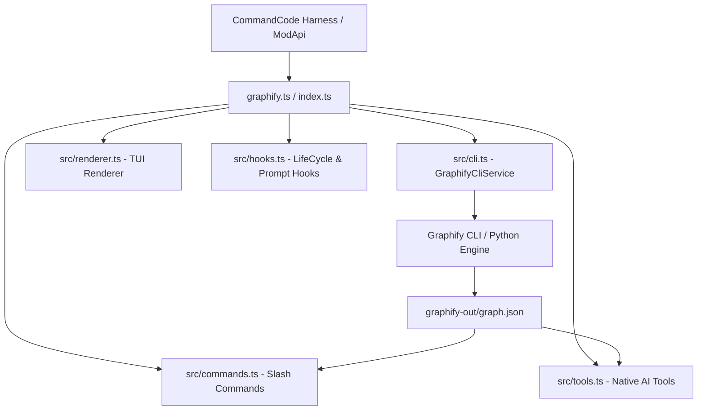

# Command and Tool Reference

Full reference for all slash commands, AI tools, and system details in `cmd-mod-graphify`.

---

## System requirements

| Component | Version | Notes |
|:---|:---|:---|
| CommandCode | v1.7.0+ | ModApi TypeScript harness |
| Graphify CLI | v0.9.32+ | `graphifyy` on PyPI |
| Node.js | v18.0.0+ | ModApi runtime |
| Python | v3.10+ | Tree-sitter AST engine |
| OS | Linux, WSL2, macOS, Windows | WSL browser auto-opener included |

---

## Architecture

### Source files

| File | Role |
|:---|:---|
| `graphify.ts` / `index.ts` | Mod entry point registering all components with ModApi |
| `src/cli.ts` | CLI execution, path resolution, WSL detection, graph.json caching |
| `src/commands.ts` | All 14 slash commands with instant feed responses |
| `src/tools.ts` | 10 native AI tools for model execution |
| `src/renderer.ts` | TUI renderer with category badges and .graphifyignore syntax highlighting |
| `src/hooks.ts` | Input shortcuts (@graph, @explain) and system prompt enrichment |
| `src/types.ts` | TypeScript interfaces and isDomainNode filtering |

---

## Slash commands

### Build and manage

| Command | Usage | Description |
|:---|:---|:---|
| `/graphify` | `/graphify [path]` | Build knowledge graph. Defaults to `--code-only --mode deep`. |
| `/graphify-update` | `/graphify-update` | Clean cache and force full graph rebuild. |
| `/graphify-clean` | `/graphify-clean` | Delete `graphify-out/` cache directory. |
| `/graphify-ignore` | `/graphify-ignore [patterns]` | View or add rules to `.graphifyignore`. |

### Query and explore

| Command | Usage | Description |
|:---|:---|:---|
| `/graphify-query` | `/graphify-query <question>` | Query the graph. AI synthesizes the response. |
| `/graphify-explain` | `/graphify-explain <symbol>` | Analyze a symbol's connections, callers, and dependencies. |
| `/graphify-path` | `/graphify-path <A> <B>` | Trace shortest path between two symbols. |
| `/graphify-god-nodes` | `/graphify-god-nodes [N]` | List top N architectural hub nodes (default: 15). |
| `/graphify-nodes` | `/graphify-nodes [filter]` | List domain nodes, optionally filtered by keyword. |

### Visualize and export

| Command | Usage | Description |
|:---|:---|:---|
| `/graphify-tree` | `/graphify-tree` | Generate interactive D3 collapsible tree. Opens in browser. |
| `/graphify-callflow` | `/graphify-callflow` | Generate Mermaid call-flow diagram. Opens in browser. |
| `/graphify-wiki` | `/graphify-wiki` | Generate structured Markdown wiki grouped by communities. |
| `/graphify-open` | `/graphify-open` | Open the interactive visual graph (graph.html) in browser. |
| `/graphify-report` | `/graphify-report` | Display the architectural summary report (GRAPH_REPORT.md). |

---

## AI tools

These tools are available to the AI model during conversation. The model can use them autonomously to explore your codebase.

| Tool | Description |
|:---|:---|
| `graphify_build` | Build or update the knowledge graph for the repository. |
| `graphify_update` | Clean cache and force a complete graph rebuild. |
| `graphify_query` | Query the graph for relationships and concepts (read-only). |
| `graphify_explain` | Get call/import/inherits connections for a symbol (read-only). |
| `graphify_path` | Find shortest path between two symbols (read-only). |
| `graphify_list_nodes` | List nodes sorted by degree or filtered by keyword (read-only). |
| `graphify_get_report` | Fetch the architectural summary report (read-only). |
| `graphify_god_nodes` | List the most connected hub nodes (read-only). |
| `graphify_tree` | Generate a D3 collapsible tree HTML visualization. |
| `graphify_callflow` | Generate a Mermaid call-flow HTML diagram. |

---

## Mod flags

| Flag | Type | Default | Description |
|:---|:---|:---|:---|
| `--auto-build` | boolean | false | Automatically build the graph on session start if no graph exists. |

---

## CLI flags

These flags can be passed to `/graphify` and `/graphify-update`:

| Flag | Description |
|:---|:---|
| `--code-only` | AST-only extraction, no LLM required (default). |
| `--with-docs` / `--all` | Include documentation files in the graph. |
| `--no-gitignore` | Ignore .gitignore patterns when scanning. |
| `--mode deep` | Deep analysis mode (always enabled by default). |

---

## File outputs

All generated files are written to `graphify-out/` in your project root:

| File | Generated by | Description |
|:---|:---|:---|
| `graph.json` | `/graphify` | The knowledge graph data (nodes, edges, communities). |
| `graph.html` | `/graphify-open` | Interactive visual graph viewer. |
| `GRAPH_TREE.html` | `/graphify-tree` | D3 collapsible tree visualization. |
| `GRAPH_REPORT.md` | `/graphify` | Architectural summary report. |
| `WIKI.md` | `/graphify-wiki` | Structured wiki by communities. |
| `*callflow*.html` | `/graphify-callflow` | Mermaid call-flow diagram. |
